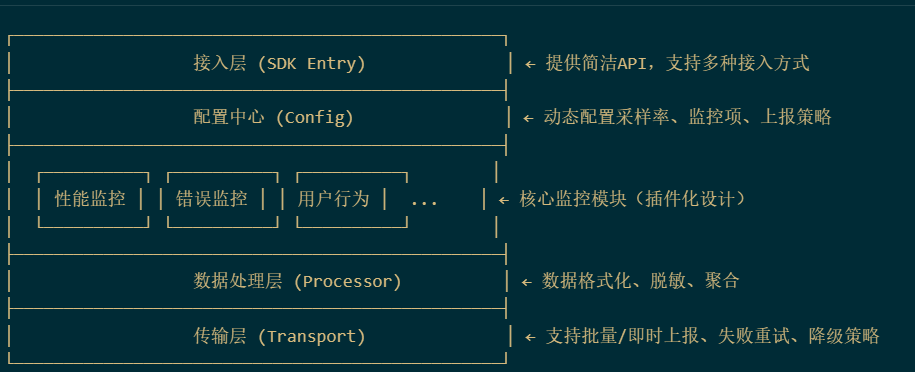

## 目录说明

- packages/: 核心模块包
  - core/: 监控 SDK 核心框架
  - plugin-\*/: 各类监控插件（性能/错误/行为等）
  - adapter-\*/: 前端框架适配层
  - utils/: 通用工具函数库
  - docs/: 项目文档
- examples/: 使用示例代码
- scripts/: 构建和部署脚本
- src/: 主应用代码（如控制台）
- test/: 测试用例
